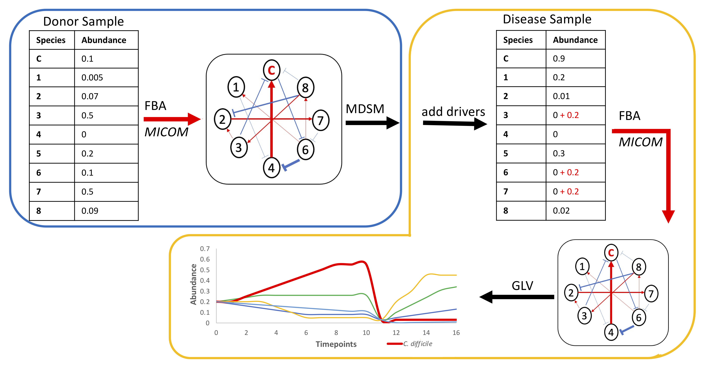

# **Bakdrive Pipeline**

Find driver species from real metagenomic data and simulate fecal microbial transplantation (FMT) process
Data analysis script and final results for the publilcation are in the data branch. Publication is [here] (https://academic.oup.com/bioinformatics/article/39/Supplement_1/i47/7210449#409576292)

## Installation 

1. Install from gitlab

```
pip install micom
pip install pulp 
git clone git@gitlab.com:treangenlab/bakdrive.git
```

2. Install from bioconda 

```
conda install bakdrive
```

**Dependencies:** [Python 3.x](https://www.python.org/download/releases/3.0/),  a python package for metabolic modeling of microbial communities [MICOM](https://github.com/micom-dev/micom), a python package of an LP modeler [PuLP](https://pypi.org/project/PuLP/)

**Database:** Database of the genome-scale metabolic reconstruction of human gut microbes [AGORA database](https://github.com/VirtualMetabolicHuman/AGORA) (default name dbs); Average western diet medium (default medium.csv)

## **Usage**

Bacdrive pipeline contains four modules: 
1. Ecological network inferences
2. Driver species identification
3. FMT process simulation: a) donor sample transplantation b) driver species transplantation

```
usage: bakdrive [-h] {interaction,driver,fmt_donor,fmt_driver,fmt_only} ...

positional arguments:
  {interaction,driver,fmt_donor,fmt_driver,fmt_only}
                        sub-command help
    interaction         Bacterial interaction inference using MICOM
    driver              Driver nodes detection using MDSM
    fmt_donor           After-FMT community construction and simulation
                        following the GLV model
    fmt_driver          Afte-driver species transplantation (ADT) community
                        consturction and simulation following the GLV model
    fmt_only            After-FMT or ADT simulation following the GLV model

optional arguments:
  -h, --help            show this help message and exit
```

### **Step1** Ecological Networks Inference 

Infer ecological networks from metagenomic taxonomic classification results using MICOM

**Notes:** This module has three types of output files for each sample.\
[temp]_community.pickle: save community constructed by MICOM\
[temp]_growth_rate.tsv: the growth rates of a given community inferred by MICOM\
[temp]_ko.tsv: the relative growth rate interactions between two species inferred by MICOM.\
It can be used to calculate the bacterial interaction matrix. 

```
usage: bakdrive interaction [-h] [-m MEDIUM] [-d MODEL] [-p PERCENTAGE]
                               [-f FLAG] [-o OUTPUT]
                               input_file

positional arguments:
  input_file            Input file of a list of taxonomic classification file
                        addresses

optional arguments:
  -h, --help            show this help message and exit
  -m MEDIUM, --medium MEDIUM
                        Medium CSV file, default medium.csv
  -d MODEL, --model MODEL
                        Metabolic model database, default dbs
  -p PERCENTAGE, --percentage PERCENTAGE
                        Percentage of species removed, default 0.1
  -f FLAG, --flag FLAG  Calculate growth rate, default True
  -o OUTPUT, --output OUTPUT
                        output folder, default output_interaction
```

**Example**

```
bakdrive interaction example/example_donor_input.txt -o example/donor_interaction
```

### **Step2** Driver Species Identification

Identify driver species from a multilayer ecological network 

**Notes:** This module has two types of output files.\
driver_nodes. [customize]layer.str[customize].txt: a list of identified driver species\
[temp]_species_ko.str[customize].undirected.txt: an undirected ecological network of each sample 

```
usage: bakdrive driver [-h] [-s STRENGTH] [-p PREFIX] [-o OUTPUT]
                          input_folder

positional arguments:
  input_folder          Input folder of bacteria interaction networks

optional arguments:
  -h, --help            show this help message and exit
  -s STRENGTH, --strength STRENGTH
                        Threshold of interaction strength, default 0.2
  -p PREFIX, --prefix PREFIX
                        Output file prefix, default driver_nodes
  -o OUTPUT, --output OUTPUT
                        Output file folder, default output_driver
```

**Example**
```
python bakdrive driver example/donor_interaction -o example/donor_drivers
```


### **Step3** Simulate Fecal Metagenomic Transplantation (FMT) Process

Simulate the FMT process following the Generalized Lotka-Volterra (GLV) model

#### a) FMT donor samples 

Add input donor sample directly to a given disease sample

**Notes:** The input file is a comma-delimited file. \
It contains two columns: the first one is a dieased sample and the second one is the corresponding donor sample.\
This module has seven types of output files for each sample.\
[temp]_micom_input.tsv: input files for MICOM. \
[temp]_community.pickle: save community constructed by MICOM.

[temp]_ko.tsv: the relative growth rate interactions between two species inferred by MICOM. \
It can be used to calculate the bacterial interaction matrix. 

[temp] _growth_rate.tsv: the growth rates of a given community inferred by MICOM. 

[temp].micom.donor.fmt.log: log of MICOM. 

fmt_abd_[temp].txt: the last timepoint of species abundance. \
fmt_timepoints_[temp].txt: a time series of species abundance.  

```
usage: bakdrive fmt_donor [-h] [-m MEDIUM] [-d MODEL] [-p PERCENTAGE]
                             [-s STRENGTH] [-o OUTPUT]
                             input_file

positional arguments:
  input_file            Input disease and donor sample file addresses

optional arguments:
  -h, --help            show this help message and exit
  -m MEDIUM, --medium MEDIUM
                        Medium CSV file, default medium.csv
  -d MODEL, --model MODEL
                        Metabolic model database, default dbs
  -p PERCENTAGE, --percentage PERCENTAGE
                        Percentage of species removed, default 0.1
  -s STRENGTH, --strength STRENGTH
                        Threshold of interaction strength, default 0.2
  -o OUTPUT, --output OUTPUT
                        Output file folder, default fmt_output
```
**Example**
```
bakdrive fmt_donor example/example_fmt_input.txt -o example/fmt_donor_output
```

#### b) FMT driver species 

Add equal amounts of driver species to the disease sample.\
**Notes:**
This module has seven types of output files for each sample.\
[temp]_micom_input.tsv: input files for MICOM\
[temp]_community.pickle: save community constructed by MICOM

[temp]_growth_rate.tsv: the growth rates of a given community inferred by MICOM

[temp]_ko.tsv: the relative growth rate interactions between two species inferred by MICOM.\
It can be used to calculate the bacterial interaction matrix.

[temp].micom.donor.fmt.log: log of MICOM\
fmt_abd_[temp].txt: the last timepoint of species abundance\
fmt_timepoints_[temp].txt: a time series of species abundance 

```
usage: bakdrive fmt_driver [-h] [-i DRIVER] [-a AMOUNT] [-m MEDIUM]
                              [-d MODEL] [-p PERCENTAGE] [-s STRENGTH]
                              [-o OUTPUT]
                              input_file

positional arguments:
  input_file            Input a list of disease sample file addresses

optional arguments:
  -h, --help            show this help message and exit
  -i DRIVER, --driver DRIVER
                        Input Driver Species
  -a AMOUNT, --amount AMOUNT
                        Input amount of driver species, default 40g
  -m MEDIUM, --medium MEDIUM
                        Medium CSV file, default medium.csv
  -d MODEL, --model MODEL
                        Metabolic model database, default dbs
  -p PERCENTAGE, --percentage PERCENTAGE
                        Percentage of species removed, default 0.1
  -s STRENGTH, --strength STRENGTH
                        Threshold of Interaction Strength, default 0.2
  -o OUTPUT, --output OUTPUT
                        Output file folder, default fmt_driver_output
```

**Example**
```
bakdrive fmt_driver example/example_disease_input.txt -i example/donor_drivers/driver_nodes.3layer.str02.txt -o example/fmt_driver_output
```

#### c) FMT only

Given an inferred ecological network of an after-FMT or ADT sample, fmt_only simulates species abundance changes following the GLV model.

**Notes:** According to the prefix of the input file, Bakdrive finds [temp]_micom_input.tsv, [temp]_ko.tsv, [temp]_growth_rate.tsv as inputs.\
[temp]_micom_input.tsv: initial bacterial abundances after-FMT or ADT\
[temp]_ko.tsv: bacterial interaction matrix\
[temp]_growth_rate.tsv: growth rate vector

```
usage: bakdrive fmt_only [-h] [-s STRENGTH] [-p PREFIX] [-o OUTPUT]
                            input-file

positional arguments:
  input-file            Input file prefix

optional arguments:
  -h, --help            show this help message and exit
  -s STRENGTH, --strength STRENGTH
                        Threshold of Interaction Strength, default 0.2
  -p PREFIX, --prefix PREFIX
                        Output file prefix
  -o OUTPUT, --output OUTPUT
                        Output file prefix
```

**Example**
```
bakdrive fmt_only example/fmt_driver_output/disease1_species_drivers -o example/disease1_drivers_fmt_only
```

## **Description**
**Pipeline**

